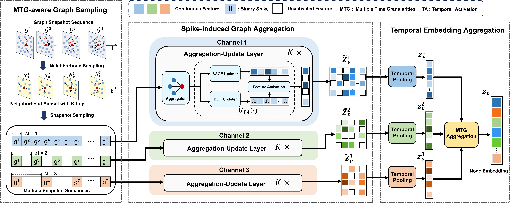

<p align="center">
  
</p>

<h1 align="center">SiGNN: Spike-induced Graph Neural Network</h1>

<p align="center">
  <a href="https://doi.org/10.1016/j.patcog.2024.111026"></a>
  <a href="https://arxiv.org/abs/2404.07941"></a>
</p>

<p align="center">
  <a href="README_zh.md">中文版</a>
</p>

SiGNN (Spike-induced Graph Neural Network) is a spiking graph neural network framework for **dynamic graph representation learning**. It combines the temporal dynamics of Spiking Neural Networks (SNNs) with the structural modeling capabilities of Graph Neural Networks (GNNs), achieving efficient node representation learning on dynamic graphs through Multi-Granularity Temporal Aggregation.

## Framework



## Project Structure

```
SiGNN/
├── main.py                          # Training entry: argument parsing, train/eval loop
├── setup.py                         # C++ extension build script
├── signn/                           # Core package
│   ├── __init__.py                  # Package exports
│   ├── model.py                     # SiGNN model
│   ├── layers.py                    # TALayer and Aggregator
│   ├── neuron.py                    # BLIF spiking neuron and surrogate gradients
│   ├── utils.py                     # Utility functions
│   ├── datasets/                    # Dataset module
│   │   ├── __init__.py
│   │   ├── base.py                  # Dataset base class
│   │   ├── dblp.py                  # DBLP co-authorship graph
│   │   ├── tmall.py                 # Tmall user-item interaction graph
│   │   └── patent.py                # US Patent citation graph
│   └── sampling/                    # Neighborhood sampling module
│       ├── __init__.py
│       ├── neighbor_sampler.py      # Sampler and RandomWalkSampler
│       └── sample_neighbor.cpp      # C++ high-performance sampling
├── data/                            # Data directory (download required)
│   ├── dblp/
│   ├── tmall/
│   └── patent/
├── LICENSE
└── README.md
```

## Installation

### Requirements

- Python >= 3.8
- PyTorch >= 1.9
- NumPy
- SciPy
- scikit-learn
- tqdm
- texttable

Optional (for random walk sampler):
- torch-cluster

### Build C++ Extension

```bash
python setup.py build_ext --inplace
```

### Data Preparation

Place dataset files in the `./data/` directory:

```
data/
├── dblp/
│   ├── dblp.txt          # Edge list (src dst timestamp)
│   ├── dblp.npy          # Node features
│   └── node2label.txt    # Node labels
├── tmall/
│   ├── tmall.txt
│   ├── tmall.npy
│   └── node2label.txt
└── patent/
    ├── patent_edges.json  # Edge list (JSON format)
    ├── patent_nodes.json  # Node labels (JSON format)
    └── patent.npy
```

## Usage

### Basic Training

```bash
# Train on DBLP dataset (default)
python main.py --dataset DBLP

# Train on Tmall dataset
python main.py --dataset Tmall

# Train on Patent dataset
python main.py --dataset Patent
```

### Custom Hyperparameters

```bash
python main.py \
    --dataset DBLP \
    --epochs 200 \
    --lr 0.005 \
    --hids 128 64 \
    --sizes 5 2 \
    --dropout 0.6 \
    --surrogate arctan \
    --alpha 1.0 \
    --p 0.5 \
    --nchannels 3 \
    --batch_size 1024 \
    --seed 2024 \
    --cuda cuda:0
```

### Command-line Arguments

| Argument | Type | Default | Description |
|----------|------|---------|-------------|
| `--dataset` | str | `DBLP` | Dataset name (DBLP/Tmall/Patent) |
| `--sizes` | int+ | `5 2` | Neighborhood sampling sizes per layer |
| `--hids` | int+ | `128 64` | Hidden dimensions per layer |
| `--aggr` | str | `mean` | Aggregation function (mean/sum) |
| `--sampler` | str | `sage` | Sampler type (sage/rw) |
| `--surrogate` | str | `arctan` | Surrogate gradient function |
| `--neuron` | str | `BLIF` | Spiking neuron type |
| `--batch_size` | int | `1024` | Batch size |
| `--lr` | float | `0.005` | Learning rate |
| `--train_size` | float | `0.4` | Training set ratio |
| `--alpha` | float | `1.0` | Surrogate gradient smoothing factor |
| `--p` | float | `0.5` | Cumulative graph sampling ratio |
| `--dropout` | float | `0.6` | Dropout probability |
| `--epochs` | int | `100` | Number of training epochs |
| `--concat` | flag | `False` | Concatenate self and neighbor representations |
| `--seed` | int | `2024` | Random seed |
| `--nchannels` | int | `3` | Number of temporal aggregation channels |
| `--cuda` | str | `cuda:0` | CUDA device |
| `--invth` | float | `1.0` | Initial voltage threshold |

### Using as a Python Package

```python
from signn import SiGNN, DBLP, set_seed

# Load data
data = DBLP(root="./data")
data.split_nodes(train_size=0.35, val_size=0.05, test_size=0.6)

set_seed(2024)

# Build model
import torch
device = torch.device("cuda:0")

model = SiGNN(
    dataset=data,
    in_features=data.num_features,
    out_features=data.num_classes,
    hids=[128, 64],
    sizes=[5, 2],
    surrogate="arctan",
    device=device,
).to(device)

# Forward pass
nodes = torch.arange(100)
logits = model(nodes)
```

## License

This project is licensed under the MIT License. See [LICENSE](LICENSE) for details.
